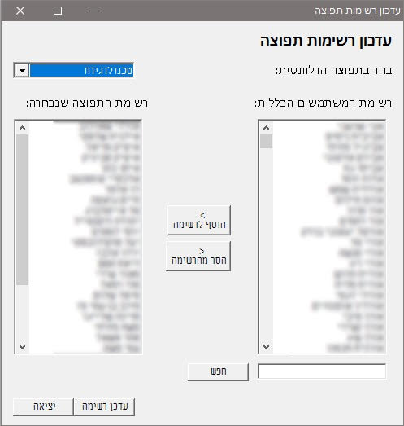

# Active directory distribution list editor

The following PowerShell script creates a dedicated tool that will give your users the ability to edit Active directory distribution lists by themselves.
By viewing the all of the company’s users and viewing the current distribution list users, the endpoint user will be able to update the Active directory distribution list of his choice (granted he has permissions) by removing or adding users.

### Main features of the project

- Utilizes windows forms using PowerShell to create a graphics user interface.
- Allows the user to search for a specific user from the domain users list (note that only users with a Hebrew name will be displayed).
- Allows editing of a few distribution lists, make sure the user has permission to edit these lists.

### Code Customization
# You can always look for the "#Changes required here" tag in the code itself
In order to use this application you will need to customize a few global variables:
$availableDivisions - an array of your company’s available divisions as they will be displayed for the user in the drop down menu.
$distributionLists - an array of the actual distribution lists as they appear in your Active directory.

## Code

Code for the PowerShel application can be found [here](Code/Update_AD_distribution_list.ps1)